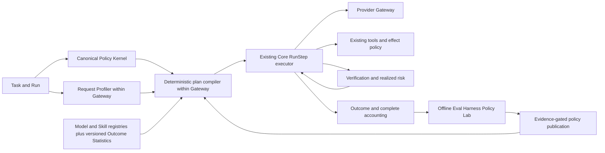
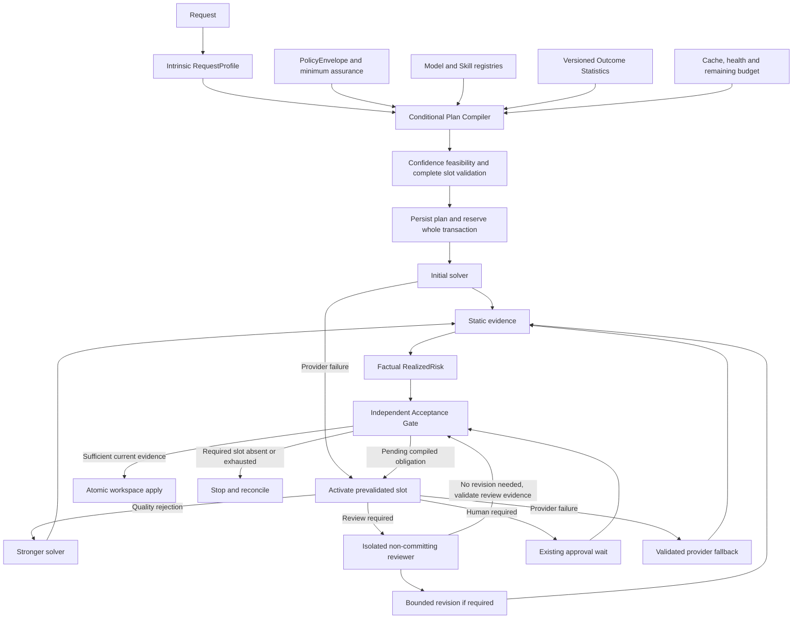

# End-to-End System Architecture

> **Authority date:** 2026-09-05  
> **Product:** Modbit — clean-slate implementation dossier  
> **Status vocabulary:** **LOCKED**, **PROVISIONAL**, **EXPERIMENT**, **DEFERRED**, **REJECTED**  
> **Source-of-truth rule:** latest explicit Modbit decision > locked decisions > current dossier > older project documents. Older Code-OSS/Modbit Lite material is historical only when it conflicts with this dossier.


## Architecture principles

1. **One canonical runtime contract.** Desktop-local and cloud-remote modes use the same domain crate, event envelope, tool contracts and policy semantics.
2. **Surfaces are clients.** UI cannot own authoritative task state or hidden business logic.
3. **State before transcript.** Resume derives from structured state/event/protocol/checkpoint records, never LLM reconstruction.
4. **Tools are effects.** Every capability is typed, policy-checked and evidence-producing.
5. **Context is compiled.** Retrieval, provenance, token economics and compaction are explicit subsystems.
6. **Isolation is an execution concern, not the brain.** MicroVM substrate is a substrate behind Modbit policy, not the orchestrator.
7. **Real verification closes the loop.** The agent cannot self-declare implementation success.

## Logical architecture

```text
┌──────────────────────────── Desktop ──────────────────────────────┐
│ React/TS Renderer                                                  │
│  └─ Preload SurfaceProtocol                                       │
│       └─ Electron Main / Surface Host                              │
│            ├─ Local IPC client                                    │
│            ├─ Browser WebContents host                            │
│            └─ OS integrations/keychain                            │
└───────────────────────────┬───────────────────────────────────────┘
                            │ authenticated local framed protocol
                            ▼
┌──────────────────────── Modbit Core ──────────────────────────────┐
│ Domain + StateGraph + WorkGraph + AgentGraph                       │
│ Agent Runtime / Scheduler / Capacity                               │
│ Execution Policy Router + Provider Gateway                         │
│ Tool Registry + Capability Kernel + Procedural Runtime             │
│ Context/Retrieval + Prompt/Skill Compiler                          │
│ Workspace/Git + Terminal + Browser adapters                        │
│ Event Store + Protocol State + Compaction + Checkpoint Manager     │
│ Engineering Memory + Evidence/Effect Ledger                        │
│ Verification Engine + Observability                                │
└───────┬───────────────────────┬───────────────────────┬───────────┘
        │                       │                       │
        ▼                       ▼                       ▼
 trusted local host      Sandbox Gateway         Model Providers
 filesystem/processes       │                  / embedding provider
 browser session            ▼
                       isolated MicroVM
                       guest RPC + PTY + Chrome

Cloud mode:
Desktop ─HTTPS/WSS─ Cloud API ─ durable DB/object store ─ Cloud Core Worker
                                      │
                                      └─ Sandbox Gateway → MicroVM
```

## Deployment units

### Desktop application
Unprivileged renderer plus hardened Electron main. Renderer has no Node integration and no direct filesystem/process access. All privileged operations go through SurfaceProtocol → Core.

### `modbit-core`
Rust daemon/service containing canonical local runtime. It owns persistent SQLite stores under the user data directory, repository index metadata, policy decisions and local execution coordination.

### `modbit-execd`
Small Rust PTY/process broker. It exists solely to keep durable process/terminal sessions attachable across renderer/Core detachment and to provide cursor-based replay. It is not a second scheduler or policy engine.

### `modbit-guest`
Guest agent image component in cloud MicroVMs. Implements typed capability-bound RPC for process, filesystem, Git, browser endpoint discovery and artifact transfer. It cannot mint capabilities or fetch secrets independently.

### Cloud API / Cloud Core Worker
Cloud API handles auth, session directory, remote task control, event streaming and artifact URLs. Cloud Core Worker runs the same agent runtime/domain crates as local Core. Cloud workers are horizontally scalable and session-leased.

### Sandbox Gateway
Tenant-authenticated boundary between Core workers and the MicroVM substrate. Validates sandbox lease, capability and effect class; brokers dynamic secret handles and network policy.

## Trust boundaries

1. **Renderer boundary** — assume web-rendered UI can be compromised; no raw secrets or privileged APIs.
2. **Browser content boundary** — all page content is untrusted data; browser instructions cannot alter system/tool policy.
3. **Model boundary** — model outputs are proposals until validated by typed tool schemas and policy.
4. **MCP/external tool boundary** — discovered schemas and returned content are untrusted; namespace + capability + size limits mandatory.
5. **Sandbox boundary** — guest is hostile/compromisable; deny internal network by default; no static credentials.
6. **Cloud tenant boundary** — every session, sandbox, object, event and secret reference is tenant-bound.

## Data flow for one verified request

1. Core loads task/Run state under the session lease; canonical Policy Kernel derives PolicyEnvelope.
2. Context Engine supplies bounded task/repository features; Gateway-owned Request Profiler emits an advisory RequestProfile.
3. Execution Plan Compiler applies hard policy/role/capability filters, joins separately versioned Outcome Statistics, selects cheapest confidence-feasible ConditionalExecutionPlan and validates all continuation slots, worst-case budget, assurance and isolation before initial dispatch.
4. Core persists the plan/reservation, then compiles role-specific context/prompt/skills/tools for the active leg.
5. Provider Gateway streams normalized model events with plan/leg/attempt attribution. Only Gateway accesses model credentials.
6. Tool Registry and Capability Kernel validate proposed actions; existing local/sandbox effectors execute permitted operations. Isolated Non-Committing Reviewer bindings permit bounded disposable evidence writes/processes while denying canonical/persistent/external effects.
7. Event/protocol stores persist exact results, workspace revisions, effects and complete attempt accounting.
8. Static evidence is collected first; policy derives factual RealizedRisk required assurance and a separate Acceptance Gate checks evidence sufficiency. Reviewer findings bind the candidate revision.
9. Core accepts or activates only prevalidated revision/escalation/review/human/provider slots within remaining budget; absent required slots stop safely. Autonomous accepted changes apply through the existing worktree/change engine after current-revision checks.
10. Outcome telemetry feeds the existing offline Eval Harness Policy Lab; privileged, evidence-gated configuration publication changes future policy versions.

The detailed boundaries are in `27_EXECUTION_POLICY_ROUTER_AND_VERIFIED_ORCHESTRATION.md` and algorithms in `38_EXECUTION_POLICY_CONTRACTS_AND_ALGORITHMS.md`.



Local Core consumes verified compatible policy/registry snapshots; hosted control-plane publication does not make local execution cloud-dependent. Desktop, CLI and web remain projection clients. Risk, state, scheduling, recovery and effect authority remain in their existing owners.

## Failure containment

- Renderer failure: Core continues; UI re-subscribes by event cursor.
- Core failure: structured stores + checkpoints reconstruct state; terminal broker/sandbox sessions reattach by lease/cursor.
- Model provider failure: router applies bounded retry/failover according to policy; no duplicate effectful tool execution.
- Tool stream loss: call ID is idempotency key; Core queries effect receipt before retry.
- Sandbox loss: restore from latest valid checkpoint into a new MicroVM; effects outside sandbox remain ledgered and are never replayed blindly.
- Browser bridge loss: session state and control lease determine reconnect; no new browser session unless old one is irrecoverable.

## Architectural anti-duplication rule

Every proposed component must map to one owner listed above. A new subsystem is rejected if it duplicates scheduling, state, policy, memory, effect tracking, context retrieval or recovery semantics already owned by Core.


## V2 cross-cutting additions

Two cross-cutting services are now explicit but **do not become new authorities**:

- **Media Pipeline** — owned beside Artifact/File + Model Gateway boundaries. It validates, budgets, transforms and provenance-binds images/PDF/audio/video before provider egress. It owns no task state, policy or context selection.
- **Skill Evolution Lab** — an offline/eval workflow around the existing Skill Registry and Eval Harness. Its trace archive/wiki/candidate data cannot become Engineering Memory, protocol state or production authority. Promotion is an atomic registry transaction after qualification.

Input steering is also promoted to a Core contract: `STEER`, `COLLECT` and `FOLLOW_UP` operate through the same cancellation domains and event log used by desktop/web/headless clients.

## Conditional execution flow after EPR v1.1



Every slot, repeat count, reachable combination and worst-case reservation is validated before initial dispatch. Diagram return arrows consume finite admitted transitions; they never authorize a generated branch or unbounded loop. Hard-ineligible plans fail before dispatch; an empty confidence-feasible set explicitly flags QUALITY_FLOOR_INFEASIBLE on the best hard-eligible alternative. Reviewer execution uses disposable scratch and bounded processes with canonical writes/external effects denied. DIRECT/CASCADE/CRITIQUE are derived path labels only. Detailed semantics, events and recovery are in docs 27/38.
