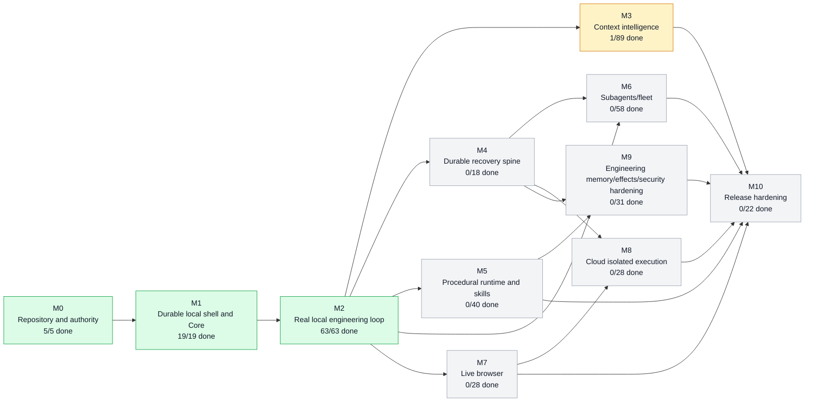
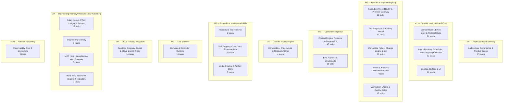
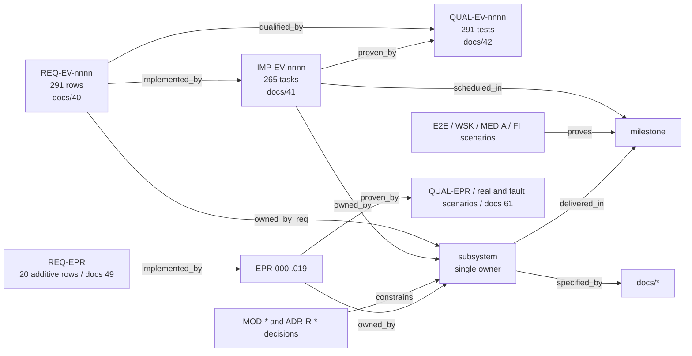
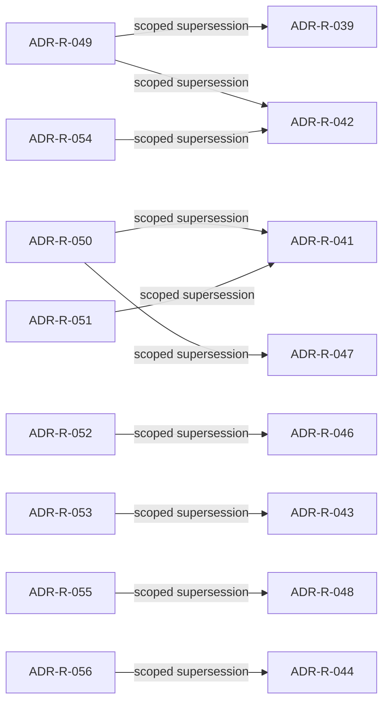

# Modbit Project Graph

> Generated from `graph/project-graph.json` by `tools/graph.py render --write`. Do not edit by hand; edit the graph through `tools/graph.py set` or regenerate structure with `tools/build_graph.py`.  
> Graph generated on 2026-09-10; view rendered on 2026-09-10.

## What the graph is

One JSON file that answers *what exists, what depends on what, what proves what, and what state each work item is in*. Node and edge types:

| Node type | Count | Meaning |
|---|---:|---|
| `section` | 8 | numbering range of the dossier |
| `doc` | 89 | one specification file in docs/ |
| `milestone` | 11 | M0–M10 from docs/43; carries proof statement and dependency edges |
| `milestone_task` | 78 | Mx.y row from docs/43 (plus five tasks the V2 sequencing delta named but did not enumerate); ordered inside its milestone; carries status |
| `subsystem` | 23 | canonical single-owner boundary (docs/81); owns REQ rows and IMP tasks; delivered in a primary milestone |
| `requirement` | 352 | REQ-EV from docs/40, additive REQ-EPR from docs/49 or additive REQ-PX from docs/62 |
| `imp_task` | 323 | IMP-EV from docs/41, EPR from docs/49 or PX from docs/62; carries status and evidence |
| `dossier_task` | 12 | governance package work outside product milestone roll-ups |
| `release_gate` | 7 | EPR promotion gate from docs/61; derived state OPEN/TASKS_COMPLETE/SATISFIED; carries attestation evidence, never a lifecycle status |
| `source_patch` | 2 | immutable user-supplied patch provenance |
| `change_record` | 8 | explicit approved dossier amendment |
| `qual_test` | 352 | QUAL-EV from docs/42, QUAL-EPR from docs/61 or QUAL-PX from docs/62 |
| `release` | 3 | ALPHA / BETA / RELEASE_ZERO projection from docs/75; readiness derived from included work items and required gates, never stored |
| `scenario` | 155 | E2E-nnn, WSK-E2E-nnn, MEDIA-E2E-nnn, EPR-E2E/FI-nnn or PX-E2E-nnn scenario, or FI-nn fault case |
| `decision` | 56 | MOD-* or ADR-R-* decision from docs/02 with authority status |

| Edge type | Count | Meaning |
|---|---:|---|
| `in_section` | 89 | doc → section |
| `references` | 479 | doc → doc (explicit filename mention) |
| `depends_on` | 18 | milestone → milestone it requires COMPLETE first |
| `part_of` | 78 | milestone_task → milestone |
| `after` | 188 | work item → required COMPLETE work item, including cross-milestone EPR dependencies |
| `delivered_in` | 22 | subsystem → primary milestone |
| `specified_by` | 205 | subsystem → doc |
| `owned_by_req` | 352 | requirement → subsystem |
| `owned_by` | 335 | imp_task → subsystem |
| `scheduled_in` | 323 | imp_task → milestone |
| `implemented_by` | 323 | requirement → imp_task |
| `qualified_by` | 352 | requirement → qual_test |
| `proven_by` | 428 | imp_task → qual_test |
| `proves` | 155 | scenario → milestone |
| `constrains` | 63 | decision → subsystem |
| `requires_task` | 27 | release gate → required implementation task |
| `extends` | 87 | additive requirement → related preserved EV requirement |
| `authorized_by` | 193 | adopted task/decision/requirement → approved change record |
| `adopts` | 2 | change record → immutable source patch |
| `supersedes` | 10 | new authority → prior authority, only within the recorded scope |
| `refines` | 5 | v1.1 source/change → previous source/change; non-conflicting authority survives |
| `gated_by` | 7 | milestone → release gate that must be SATISFIED before the milestone rolls up COMPLETE |
| `includes` | 835 | release → product work item whose COMPLETE status the release requires |
| `requires_gate` | 7 | release → release gate that must be SATISFIED before the release is READY |

## Milestone dependency graph (live status)



Critical path (reliability spine): **M0 → M1 → M2 → M4**. Do not start broad multi-agent or cloud work before the single-agent durable local loop is E2E proven.

## Milestone roll-up

| Milestone | State | Unblocked | Milestone tasks | Implementation tasks | Complete | Blocked | Depends on | Proof |
|---|---|---|---:|---:|---:|---:|---|---|
| M0 Repository and authority | COMPLETE | yes | 4 | 1 | 5 | 0 | — | clean clone build + architecture lint |
| M1 Durable local shell and Core | COMPLETE | yes | 5 | 14 | 19 | 0 | M0 | user creates durable task, kills/restarts app/Core, same task recovers with no fake state. |
| M2 Real local engineering loop | COMPLETE | yes | 10 | 53 | 63 | 0 | M1 | E2E-001/002/003 with live model and actual test pass. |
| M3 Context intelligence | IN_PROGRESS | yes | 9 | 80 | 1 | 0 | M2 | profile A/B/C benchmark plus retrieval-before-edit visible in task evidence. |
| M4 Durable recovery spine | NOT_STARTED | yes | 6 | 12 | 0 | 0 | M2 | E2E-004/005/006/007/008. |
| M5 Procedural runtime and skills | NOT_STARTED | yes | 7 | 33 | 0 | 0 | M2 | E2E-011/012; direct and procedural mode yield equivalent receipts/policy behavior. |
| M6 Subagents/fleet | NOT_STARTED | no | 7 | 51 | 0 | 0 | M2, M4 | E2E-009/010 and user can supervise multiple tasks without raw-log polling. |
| M7 Live browser | NOT_STARTED | yes | 8 | 20 | 0 | 0 | M2 | E2E-013..016. |
| M8 Cloud isolated execution | NOT_STARTED | no | 9 | 19 | 0 | 0 | M4, M7 | E2E-017/018/024. |
| M9 Engineering memory/effects/security hardening | NOT_STARTED | no | 6 | 25 | 0 | 0 | M4, M5 | memory cannot be created from transcript without promotion; receipt chain verifies; threat tests pass. |
| M10 Release hardening | NOT_STARTED | no | 7 | 15 | 0 | 0 | M3, M5, M6, M7, M8, M9 | full Release Zero proof + package evidence + EPR gates A–G SATISFIED. |

## Subsystems → milestones

Each canonical subsystem is a single-owner boundary (`docs/81_ARCHITECTURE_GUARDRAILS_AND_FORBIDDEN_DUPLICATION.md`). The milestone shown is where the bulk of its `IMP-EV-*` tasks are scheduled; individual tasks may be scheduled elsewhere.



| Subsystem | Primary milestone | Crates / apps | Spec docs | REQ rows | IMP tasks | Decisions |
|---|---|---|---|---:|---:|---|
| `automation` Automation / Scheduling (DEFERRED) | — | — | `02` | 2 | 0 | MOD-MOBILE-001, MOD-AUTO-001 |
| `browser` Browser & Computer Runtime | M7 | `crates/browser` | `22` | 18 | 18 | MOD-BROWSE-001 |
| `context-engine` Context Engine, Retrieval & Diagnostics | M3 | `crates/context`, `crates/retrieval`, `crates/diagnostics` | `18`, `28`, `76` | 48 | 45 | MOD-CTX-001, MOD-CTX-002, MOD-EMB-001, MOD-CTX-003 |
| `core-runtime` Agent Runtime, Scheduler, WorkGraph/AgentGraph | M1 | `crates/core-runtime` | `14`, `28`, `38` | 55 | 52 | MOD-CORE-001, MOD-AGENT-001, MOD-ORCH-001, MOD-INPUT-001, ADR-R-042, ADR-R-043, ADR-R-047, ADR-R-048, ADR-R-049, ADR-R-053, ADR-R-054 |
| `desktop` Desktop Surface & UI | M1 | `apps/desktop`, `apps/cli`, `packages/ui`, `packages/surface-protocol`, `packages/ide-adapter-core`, `packages/design-tokens` | `10`, `29`, `32`, `39` | 23 | 20 | MOD-SURF-001, MOD-SURF-002, MOD-UX-001, MOD-DESK-001 |
| `domain-events` Domain Model, Event Store & Protocol State | M1 | `crates/domain`, `crates/protocol`, `crates/event-store`, `crates/protocol-state` | `13`, `30`, `31`, `38` | 24 | 20 | — |
| `durability` Compaction, Checkpoints & Recovery Spine | M4 | `crates/compaction`, `crates/checkpoint` | `19` | 4 | 4 | MOD-STATE-001, MOD-STATE-002, MOD-STATE-003 |
| `effects-security` Policy Kernel, Effect Ledger & Secrets | M9 | `crates/policy`, `crates/effects`, `crates/secrets` | `23`, `52`, `38` | 19 | 18 | MOD-EFFECT-001, ADR-R-043, ADR-R-046, ADR-R-052, ADR-R-053 |
| `eval-bench` Eval Harness & Benchmarks | M3 | `benchmarks/retrieval`, `benchmarks/context-economics`, `benchmarks/agent-engineering`, `benchmarks/latency` | `53`, `61`, `63`, `38` | 21 | 18 | MOD-JIT-001, ADR-R-044, ADR-R-051, ADR-R-056 |
| `extensions-hooks` Hook Bus, Extension System & Importers | M9 | `crates/tools (hooks)`, `crates/skills (import)` | `25` | 8 | 7 | — |
| `external-tools` MCP Hub, Integrations & Web Gateway | M9 | `crates/tools (external.*)`, `crates/tools (forge.*)` | `16`, `29` | 6 | 5 | — |
| `governance` Architecture Governance & Product Scope | M0 | `tools/architecture-lint`, `tools/evidence-check`, `docs/decisions` | `02`, `03`, `76`, `81`, `82` | 9 | 15 | MOD-PROD-001, MOD-IDE-001, MOD-IDE-002, MOD-COV-001 |
| `media` Media Pipeline & Artifact Store | M5 | `crates/tools (media)`, `object store` | `25` | 5 | 5 | MOD-MEDIA-001, MOD-MEDIA-002, MOD-MM-001 |
| `memory` Engineering Memory | M9 | `crates/memory` | `19` | 1 | 1 | — |
| `model-gateway` Execution Policy Router & Provider Gateway | M2 | `crates/providers` | `15`, `27`, `38` | 11 | 11 | ADR-R-039, ADR-R-040, ADR-R-041, ADR-R-047, ADR-R-049, ADR-R-050 |
| `observability` Observability, Cost & Operations | M10 | `crates/observability` | `34`, `71`, `38` | 6 | 5 | ADR-R-045, ADR-R-048, ADR-R-055 |
| `procedural-runtime` Procedural Tool Runtime | M5 | `crates/procedural-runtime` | `16` | 2 | 2 | — |
| `sandbox-cloud` Sandbox Gateway, Guest & Cloud Control Plane | M8 | `crates/sandbox`, `apps/cloud-api`, `apps/cloud-worker`, `apps/sandbox-gateway`, `services/modbit-guest` | `21`, `24` | 15 | 14 | MOD-SBX-001, MOD-AUTH-001, MOD-CLOUD-001 |
| `skills` Skill Registry, Compiler & Evolution Lab | M5 | `crates/skills`, `crates/prompt-compiler` | `26`, `38` | 21 | 21 | MOD-SKILL-001, MOD-SKILL-002 |
| `terminal` Terminal Broker & Execution Router | M2 | `crates/terminal`, `services/modbit-execd` | `21` | 7 | 7 | MOD-EXEC-001, MOD-EXEC-002 |
| `tool-runtime` Tool Registry & Capability Kernel | M2 | `crates/tools`, `crates/policy` | `16`, `17` | 10 | 10 | MOD-TOOL-001, MOD-TOOL-002, MOD-TOOL-003 |
| `verification` Verification Engine & Quality Gates | M2 | `crates/verification`, `tools/release-gate` | `28`, `50`, `51`, `63`, `64`, `76`, `83`, `38`, `61` | 17 | 17 | MOD-VERIFY-001, ADR-R-052, ADR-R-056 |
| `workspace-git` Workspace Fabric, Change Engine & Git | M2 | `crates/workspace`, `crates/git` | `20`, `64` | 20 | 20 | — |

## Requirement → task → test chain



Disposition counts: ADAPT 63, ADOPT 247, ALREADY COVERED 11, DEFERRED 12, EXPERIMENT 13, REJECT 6.

## Execution policy development dependencies

EPR requirements extend the preserved EV ledger under DR-EPR-2026-09-05-v1.1; v1.0 conflicting clauses are superseded in place. All nodes use existing canonical owners. Gate nodes describe evidence required for activation; document existence is not proof.

```mermaid
flowchart LR
  EPR_000["EPR-000<br/>Preserve and measure the direct baseline<br/>NOT_STARTED"]
  EPR_001["EPR-001<br/>Version routing contracts and durable Run state<br/>NOT_STARTED"]
  EPR_002["EPR-002<br/>Extend the Model Registry with current role bindings<br/>NOT_STARTED"]
  EPR_003["EPR-003<br/>Bootstrap and calibrate the Request Profiler<br/>NOT_STARTED"]
  EPR_004["EPR-004<br/>Compile and validate one bounded conditional plan<br/>NOT_STARTED"]
  EPR_005["EPR-005<br/>Integrate initial execution and preserve direct baseline<br/>NOT_STARTED"]
  EPR_006["EPR-006<br/>Activate prevalidated escalation continuations<br/>NOT_STARTED"]
  EPR_007["EPR-007<br/>Integrate isolated review and bounded revision<br/>NOT_STARTED"]
  EPR_008["EPR-008<br/>Derive factual policy-owned assurance requirements<br/>NOT_STARTED"]
  EPR_009["EPR-009<br/>Persist routing epochs and switch economics<br/>NOT_STARTED"]
  EPR_010["EPR-010<br/>Capture request, leg and gate accounting/outcomes<br/>NOT_STARTED"]
  EPR_011["EPR-011<br/>Build isolated counterfactual replay<br/>NOT_STARTED"]
  EPR_012["EPR-012<br/>Jointly evaluate conditional parameters and promote policy<br/>NOT_STARTED"]
  EPR_013["EPR-013<br/>Qualify model × Skill outcome statistics<br/>NOT_STARTED"]
  EPR_014["EPR-014<br/>Conditional plan migration and slot admission<br/>NOT_STARTED"]
  EPR_015["EPR-015<br/>Versioned Outcome Statistics materialization<br/>NOT_STARTED"]
  EPR_016["EPR-016<br/>Confidence-adjusted feasibility and cold start<br/>NOT_STARTED"]
  EPR_017["EPR-017<br/>Separate assurance classification and acceptance<br/>NOT_STARTED"]
  EPR_018["EPR-018<br/>Isolated Non-Committing Reviewer environment<br/>NOT_STARTED"]
  EPR_019["EPR-019<br/>Independent gate calibration release suite<br/>NOT_STARTED"]
  M2_9 --> EPR_000
  EPR_000 --> EPR_001
  EPR_001 --> EPR_002
  EPR_002 --> EPR_003
  EPR_014 --> EPR_004
  EPR_016 --> EPR_004
  EPR_004 --> EPR_005
  EPR_017 --> EPR_006
  EPR_009 --> EPR_006
  M3_9 --> EPR_006
  EPR_018 --> EPR_007
  M6_5 --> EPR_007
  EPR_005 --> EPR_008
  M4_6 --> EPR_008
  EPR_005 --> EPR_009
  M4_6 --> EPR_009
  EPR_007 --> EPR_010
  EPR_009 --> EPR_010
  EPR_007 --> EPR_011
  EPR_010 --> EPR_011
  M9_3 --> EPR_011
  EPR_011 --> EPR_012
  EPR_009 --> EPR_012
  EPR_019 --> EPR_012
  M10_1 --> EPR_012
  EPR_012 --> EPR_013
  M5_7 --> EPR_013
  EPR_001 --> EPR_014
  EPR_002 --> EPR_015
  EPR_003 --> EPR_016
  EPR_015 --> EPR_016
  EPR_008 --> EPR_017
  M4_6 --> EPR_017
  EPR_006 --> EPR_018
  M6_4 --> EPR_018
  EPR_007 --> EPR_019
  EPR_017 --> EPR_019
  EPR_010 --> EPR_019
  EPR_013 --> M10_3
  EPR_019 --> M10_3
```



| Task | Milestone / phase | Status | Owner | Prerequisites | Requirement / qualification |
|---|---|---|---|---|---|
| EPR-000 | M3 / 0 | NOT_STARTED | model-gateway | M2.9 | REQ-EPR-000 / QUAL-EPR-000 |
| EPR-001 | M3 / 1 | NOT_STARTED | domain-events | EPR-000 | REQ-EPR-001 / QUAL-EPR-001 |
| EPR-002 | M3 / 1 | NOT_STARTED | model-gateway | EPR-001 | REQ-EPR-002 / QUAL-EPR-002 |
| EPR-003 | M3 / 1 | NOT_STARTED | model-gateway | EPR-002 | REQ-EPR-003 / QUAL-EPR-003 |
| EPR-004 | M3 / 1 | NOT_STARTED | model-gateway | EPR-014, EPR-016 | REQ-EPR-004 / QUAL-EPR-004 |
| EPR-005 | M3 / 1-2 | NOT_STARTED | core-runtime | EPR-004 | REQ-EPR-005 / QUAL-EPR-005 |
| EPR-006 | M5 / 3 | NOT_STARTED | core-runtime | EPR-017, EPR-009, M3.9 | REQ-EPR-006 / QUAL-EPR-006 |
| EPR-007 | M6 / 4 | NOT_STARTED | core-runtime | EPR-018, M6.5 | REQ-EPR-007 / QUAL-EPR-007 |
| EPR-008 | M4 / 2-4 | NOT_STARTED | effects-security | EPR-005, M4.6 | REQ-EPR-008 / QUAL-EPR-008 |
| EPR-009 | M4 / 2-4 | NOT_STARTED | core-runtime | EPR-005, M4.6 | REQ-EPR-009 / QUAL-EPR-009 |
| EPR-010 | M9 / 5 | NOT_STARTED | observability | EPR-007, EPR-009 | REQ-EPR-010 / QUAL-EPR-010 |
| EPR-011 | M9 / 5 | NOT_STARTED | eval-bench | EPR-007, EPR-010, M9.3 | REQ-EPR-011 / QUAL-EPR-011 |
| EPR-012 | M10 / 5 | NOT_STARTED | eval-bench | EPR-011, EPR-009, EPR-019, M10.1 | REQ-EPR-012 / QUAL-EPR-012 |
| EPR-013 | M10 / 6 | NOT_STARTED | skills | EPR-012, M5.7 | REQ-EPR-013 / QUAL-EPR-013 |
| EPR-014 | M3 / 1 | NOT_STARTED | core-runtime | EPR-001 | REQ-EPR-014 / QUAL-EPR-014 |
| EPR-015 | M3 / 1 | NOT_STARTED | eval-bench | EPR-002 | REQ-EPR-015 / QUAL-EPR-015 |
| EPR-016 | M3 / 1 | NOT_STARTED | model-gateway | EPR-003, EPR-015 | REQ-EPR-016 / QUAL-EPR-016 |
| EPR-017 | M4 / 2-3 | NOT_STARTED | verification | EPR-008, M4.6 | REQ-EPR-017 / QUAL-EPR-017 |
| EPR-018 | M6 / 4 | NOT_STARTED | effects-security | EPR-006, M6.4 | REQ-EPR-018 / QUAL-EPR-018 |
| EPR-019 | M9 / 5 | NOT_STARTED | eval-bench | EPR-007, EPR-017, EPR-010 | REQ-EPR-019 / QUAL-EPR-019 |

| Activation gate | State | Required tasks | Attestation evidence | Acceptance |
|---|---|---|---|---|
| EPR-GATE-A: Conditional correctness and assurance | OPEN | EPR-001, EPR-002, EPR-004, EPR-005, EPR-008, EPR-014, EPR-017 | none | Schema-2 conditional admission, every slot prevalidated/budgeted, finite retries/termination, no generated branch, separate risk/acceptance and no partial apply |
| EPR-GATE-B: Initial-leg DIRECT baseline non-regression | OPEN | EPR-000, EPR-005 | none | Actual initial-to-accept path preserves verified success, cost/latency tolerances, recovery/tool reliability and complete direct-attempt accounting |
| EPR-GATE-C: Profiler and confidence-adjusted feasibility | OPEN | EPR-002, EPR-003, EPR-015, EPR-016 | none | Intrinsic profiler calibration/OOD, versioned representative statistics, LCB/posterior tau/delta, cold-start rejection, lowest-cost feasible and explicit QUALITY_FLOOR_INFEASIBLE |
| EPR-GATE-D: Escalation CASCADE path benefit | OPEN | EPR-006, EPR-017, EPR-019 | none | Whole-plan conservative quality floor, lower complete expected cost on approved slice, bounded rejection/escalation latency; acceptance/risk error thresholds independently pass |
| EPR-GATE-E: Isolated review CRITIQUE path benefit | OPEN | EPR-007, EPR-018, EPR-019 | none | Relational defect/critical recall and success gain; acceptable false positives/churn/inference/tool/process cost; allowed ephemeral work and denied canonical/persistent/external effects; no solver hidden reasoning |
| EPR-GATE-F: Multi-turn economics | OPEN | EPR-000, EPR-009, EPR-016 | none | Confidence-feasible switch remains better after lost cache/refill/write/latency/hysteresis, no unnecessary switching regression, fenced slot/restart behavior |
| EPR-GATE-G: Independently safe gate calibration and rollout | OPEN | EPR-010, EPR-011, EPR-012, EPR-013, EPR-019 | none | Separate request/leg/gate attribution, holdout acceptance false accept/reject and realized-risk false negative/positive plus critical_surface_miss_rate within approved limits; controlled promotion/propensity, safe replay, compatible previous-good rollback |

Gate state is derived (docs/93): OPEN until every required task is COMPLETE, TASKS_COMPLETE, then SATISFIED once attested with `graph.py attest`. A milestone linked by `gated_by` rolls up GATED, not COMPLETE, until all its gates are SATISFIED: M10 → EPR-GATE-A, EPR-GATE-B, EPR-GATE-C, EPR-GATE-D, EPR-GATE-E, EPR-GATE-F, EPR-GATE-G.

## Release readiness (derived)

Releases are projections over work items and gates (docs/75). Readiness is computed, never set: NOT_READY until every included item is COMPLETE and every required gate SATISFIED; BLOCKED if any included item is BLOCKED.

| Release | State | Included work items | Complete | Blocked | Required gates | Rule |
|---|---|---:|---:|---:|---|---|
| ALPHA: Local coding loop and recovery spine | NOT_READY | 114 | 86 | 0 | none | / ALPHA / Local coding loop and recovery spine / M0, M1, M2, M4 / M2.10 / EPR- / — / — / |
| BETA: Intelligence, fleet and browser | NOT_READY | 320 | 88 | 0 | none | / BETA / Intelligence, fleet and browser / M0, M1, M2, M3, M4, M5, M6, M7 / — / — / — / — / |
| RELEASE_ZERO: Full end-to-end proof | NOT_READY | 401 | 88 | 0 | EPR-GATE-A, EPR-GATE-B, EPR-GATE-C, EPR-GATE-D, EPR-GATE-E, EPR-GATE-F, EPR-GATE-G | / RELEASE_ZERO / Full end-to-end proof / ALL / — / — / — / EPR-GATE-A, EPR-GATE-B, EPR-GATE-C, EPR-GATE-D, EPR-GATE-E, EPR-GATE-F, EPR-GATE-G / |

## Scoped v1.1 supersessions and source provenance



| New decision | Earlier decision | Replaced/refined scope (other clauses survive) |
|---|---|---|
| ADR-R-049 | ADR-R-039 | Primary template selection replaced; model neutrality retained |
| ADR-R-049 | ADR-R-042 | Conditional slots refine shared executor |
| ADR-R-050 | ADR-R-041 | Confidence-feasibility and cost ordering refine deterministic compiler |
| ADR-R-050 | ADR-R-047 | Feasible switch economics replace soft utility |
| ADR-R-051 | ADR-R-041 | Separately versioned statistics added to compiler inputs |
| ADR-R-052 | ADR-R-046 | Required assurance separated from evidence acceptance |
| ADR-R-053 | ADR-R-043 | Disposable review writes/exec replace absolute effect-less tool restriction |
| ADR-R-054 | ADR-R-042 | Continuation graph prevalidated before transaction |
| ADR-R-055 | ADR-R-048 | Request/leg/gate attribution refines complete accounting |
| ADR-R-056 | ADR-R-044 | Independent gate/risk calibration strengthens promotion |

- `MODBIT-PATCH-EPR-2026-09-05`: `MODBIT-PATCH-Execution-Policy-Router-and-Verified-Multi-Model-Orchestration.md`; SHA-256 `9e0cee7d49d442033b875e250a61a212b898dd6f4bf35826cdad5ffeb71edb66`.
- `MODBIT-PATCH-EPR-2026-09-05-v1.1`: `MODBIT-PATCH-EPR-v1.1-Supersession-and-Refinement.md`; SHA-256 `30dbacdb3a37b364f535f55ed7bf4ea8fa35d70cd6f85c9a61897ac9db72f2bd`.

## Dossier work (excluded from product roll-ups)

- `DOC-EPR-001`: COMPLETE; Adopt execution policy patch into development dossier; evidence: run:dossier-epr-2026-09-05-final, artifact:evidence/dossier-epr/validation.json, artifact:evidence/dossier-epr/tests.log, revision:sha256:4eee4d2ed0a2e334ae4c903e0b7cbd872e4827d71b6b864257746806af363f51
- `DOC-EPR-002`: COMPLETE; Integrate and reseal EPR v1.1 supersession; evidence: artifact:evidence/dossier-epr-v1.1/validation.json, artifact:evidence/dossier-epr-v1.1/tests.log, revision:sha256:c5c151160d074ab8e1d5d6280c14309ef8d58f8939be07cdea3297f2913aa3a4
- `DOC-GOV-001`: COMPLETE; Reseal governing files, evidence grammar and decision statuses; evidence: run:dossier-gov-2026-09-05-final, artifact:evidence/dossier-gov/validation.json, artifact:evidence/dossier-gov/tests.log, revision:sha256:d5d9333148ba10f30634034f883c8c90af46ca1991e8a93799cc5d97859ded80
- `DOC-GOV-002`: COMPLETE; Align implementation specs and execution profiles with EPR v1.1; evidence: run:dossier-gov-002-2026-09-05-final, artifact:evidence/dossier-gov-002/validation.json, artifact:evidence/dossier-gov-002/tests.log, revision:sha256:8e9f70a42a14d6592ac53f463385a61bcdc4f5563045b9f7a5499fc13051522d, commit:e39f3a477b5234c1ca519c692cbc0b8db880d71a
- `DOC-GOV-003`: COMPLETE; Enforce release-gate attestation and one-step lifecycle transitions; evidence: run:dossier-gov-003-2026-09-05-final, artifact:evidence/dossier-gov-003/validation.json, artifact:evidence/dossier-gov-003/tests.log, revision:sha256:1072a96f9b3564a839a12ab40243fbced08e732458c5df62cabb0ab2c2ab253d, commit:d426b1be87768e28acb8c30eca0330daa0f674e9
- `DOC-GOV-004`: COMPLETE; Integrate EPR patches into product, cloud, durability and acceptance docs; add coverage map; evidence: run:dossier-gov-004-2026-09-05-final, artifact:evidence/dossier-gov-004/validation.json, artifact:evidence/dossier-gov-004/tests.log, revision:sha256:a6914e8017a318b9c3de28de5aabd553c3f6d2d7d676ebafcbf765067c2206d1, commit:f2b7250762e04f7ab68cf44530b2a3a9b1afd769
- `DOC-PX-001`: COMPLETE; Product extension stage A: authority, PX ledger tooling, phased releases, governance tiering; evidence: run:dossier-px-001-2026-09-05-final, artifact:evidence/dossier-px-001/validation.json, artifact:evidence/dossier-px-001/tests.log, revision:sha256:05c2315e268ab955cf4e36ea06d265d6ca225143bddcdc87451ca3df6e8f0928, commit:5922b8a4d7f29548db3215849a47799fb7159804
- `DOC-PX-002`: COMPLETE; Product extension stage B: client surfaces and source-control integration; evidence: run:dossier-px-002-2026-09-05-final, artifact:evidence/dossier-px-002/validation.json, artifact:evidence/dossier-px-002/tests.log, revision:sha256:ce8d988063618190ba85aa89ee6ba232b99ffb6988a1d66abdaed62c015e7bd8, commit:d3a59027b71c9b4199dddb24155b873955e96d80
- `DOC-PX-003`: COMPLETE; Product extension stage C: agent competence contracts and benchmarks; evidence: run:dossier-px-003-2026-09-05-final, artifact:evidence/dossier-px-003/validation.json, artifact:evidence/dossier-px-003/tests.log, revision:sha256:e33784d705285e73e40f6c0499cef1358c2b018bd36005739678748995dc1adb, commit:ffe242b997dc43592443d7637f16e759dc3af8b6
- `DOC-PX-004`: COMPLETE; Product extension stage D: UX flows, onboarding and interaction budgets; evidence: run:dossier-px-004-2026-09-05-final, artifact:evidence/dossier-px-004/validation.json, artifact:evidence/dossier-px-004/tests.log, revision:sha256:afd47083a105c959760a5ec04dcd4a56b777e5ccdcc143ef29945b55a2e705cb, commit:46ffd21796431c2df4805b0fe168b66c375f66e7
- `DOC-PX-005`: COMPLETE; Product extension stage E: language and platform support matrix; evidence: run:dossier-px-005-2026-09-05-final, artifact:evidence/dossier-px-005/validation.json, artifact:evidence/dossier-px-005/tests.log, revision:sha256:786117af583dca78214f2ecd17b0ccd5d07880274969bbf1cbee6b107aada985, commit:df76087d60f80f8f6192ed359254e14b321db573
- `DOC-PX-006`: COMPLETE; Product extension stage F: verification execution mechanics, scope bounds, repair policy and agent harness contracts; evidence: run:dossier-px-006-2026-09-05-final, artifact:evidence/dossier-px-006/validation.json, artifact:evidence/dossier-px-006/tests.log, revision:sha256:060860f40e2b4c8180d52047013627d38a48692bb51af19efc5a9951bcb82c4f, commit:4a3f6df023f82c03df1a8fd7051a219d885232ed

## Milestone tasks in execution order

### M0 — Repository and authority

| Task | Status | Title | Acceptance / note |
|---|---|---|---|
| `M0.1` | COMPLETE | Create monorepo, Rust workspace, pnpm workspace, CI, architecture-lint | fresh clone builds on macOS/Linux/Windows CI; forbidden dependency test works. CI on Windows and Linux establishes CI_COMPATIBLE only; macOS is the Alpha release platform and other platforms are promoted separately (`76_LANGUAGE_AND_PLATFORM_SUPPORT_MATRIX.md`). |
| `M0.2` | COMPLETE | Add authoritative ADRs and status ledger | CI rejects changed locked architecture file without linked ADR metadata. |
| `M0.3` | COMPLETE | Protobuf domain/protocol generation Rust↔TS | round-trip compatibility tests. |
| `M0.4` | COMPLETE | Requirement-coverage CI and REQ→IMP→QUAL traceability parser | CI fails on ADOPT/ADAPT row without owner/IMP-EV/QUAL-EV, COMPLETE task without evidence, or duplicate active owner |

### M1 — Durable local shell and Core

| Task | Status | Title | Acceptance / note |
|---|---|---|---|
| `M1.1` | COMPLETE | Implement Session/Task/Run/Turn/RunStep domain and event store |  |
| `M1.2` | COMPLETE | Implement SQLite migrations, projections, command idempotency |  |
| `M1.3` | COMPLETE | Implement local authenticated SurfaceProtocol |  |
| `M1.4` | COMPLETE | Electron shell + real Fleet/New Task UI against Core |  |
| `M1.5` | COMPLETE | Crash/restart snapshot + event replay |  |

### M2 — Real local engineering loop

| Task | Status | Title | Acceptance / note |
|---|---|---|---|
| `M2.1` | COMPLETE | Workspace File Service with safe paths/revisions |  |
| `M2.2` | COMPLETE | Git branch/worktree/diff operations |  |
| `M2.3` | COMPLETE | `modbit-execd` structured argv/PTy/replay/OutputRef |  |
| `M2.4` | COMPLETE | Tool Registry + direct `fs/git/shell/test` tools |  |
| `M2.5` | COMPLETE | Capability Kernel + basic approval flow |  |
| `M2.6` | COMPLETE | Provider Gateway OpenAI + Anthropic streaming |  |
| `M2.7` | COMPLETE | Basic Prompt Compiler and one-agent runtime |  |
| `M2.8` | COMPLETE | Verification engine build/test checks | derived plan recorded before the first run; BASELINE, TARGETED and COMPLETION stages with regression attribution; normalized `TestReport`/`CheckResult` from real runners on the Alpha fixtures; flake rerun protocol; diff invariants DI-1..DI-9 (`64_VERIFICATION_EXECUTION_CONTRACTS.md`, PX-032..034/036/037). |
| `M2.9` | COMPLETE | Trusted Code Review Surface |  |
| `M2.10` | COMPLETE | MediaEnvelope + Media Pipeline (before any multimodal provider/tool feature) | real PNG/JPEG/text-PDF read through fs.read with provenance, budgets and artifact digests |

### M3 — Context intelligence

| Task | Status | Title | Acceptance / note |
|---|---|---|---|
| `M3.1` | COMPLETE | exact/regex/path index |  |
| `M3.2` | WIRED | Tantivy BM25 |  |
| `M3.3` | NOT_STARTED | tree-sitter AST/symbol index |  |
| `M3.4` | NOT_STARTED | headless LSP diagnostics/symbol bridge |  |
| `M3.5` | NOT_STARTED | USearch embeddings + changed-chunk incremental update |  |
| `M3.6` | NOT_STARTED | dependency/Git/test/runtime evidence graph |  |
| `M3.7` | NOT_STARTED | L0-L3 retrieval planner + fusion |  |
| `M3.8` | NOT_STARTED | Context Pack/token budget/provenance ledger |  |
| `M3.9` | NOT_STARTED | retrieval benchmark harness |  |

### M4 — Durable recovery spine

| Task | Status | Title | Acceptance / note |
|---|---|---|---|
| `M4.1` | NOT_STARTED | Protocol State store |  |
| `M4.2` | NOT_STARTED | Compaction epochs + async worker + stale rejection + sync fallback |  |
| `M4.3` | NOT_STARTED | Workspace checkpoint baseline/delta objects + epoch fencing |  |
| `M4.4` | NOT_STARTED | kernel lease/session fencing |  |
| `M4.5` | NOT_STARTED | terminal/browser/sandbox cursor metadata interfaces |  |
| `M4.6` | NOT_STARTED | kill-point recovery suite |  |

### M5 — Procedural runtime and skills

| Task | Status | Title | Acceptance / note |
|---|---|---|---|
| `M5.1` | NOT_STARTED | Dynamic task-scoped tool projection |  |
| `M5.2` | NOT_STARTED | embedded QuickJS isolate with no ambient authority |  |
| `M5.3` | NOT_STARTED | generated `tools.*` bindings routed through normal Tool Registry |  |
| `M5.4` | NOT_STARTED | exec/wait/request_user_input surface |  |
| `M5.5` | NOT_STARTED | skill manifest/selector/compiler, provenance and signing |  |
| `M5.6` | NOT_STARTED | tool-schema/token-economics benchmark |  |
| `M5.7` | NOT_STARTED | Skill Evolution Lab as shadow/EXPERIMENT behind Skill Registry + Eval Harness | WSK-E2E-001..010; candidate cannot self-promote; production recovery independent of lab data |

### M6 — Subagents/fleet

| Task | Status | Title | Acceptance / note |
|---|---|---|---|
| `M6.1` | NOT_STARTED | WorkGraph/AgentGraph projections |  |
| `M6.2` | NOT_STARTED | capacity ticket allocator |  |
| `M6.3` | NOT_STARTED | transactional subagent admission |  |
| `M6.4` | NOT_STARTED | semantic write-conflict detector |  |
| `M6.5` | NOT_STARTED | subagent result/evidence handoff |  |
| `M6.6` | NOT_STARTED | attention-first Fleet states/UI |  |
| `M6.7` | NOT_STARTED | Durable subagent continuation (background child survives restart) | kill Core mid-child run; child identity, lineage, event offsets and result envelope survive |

### M7 — Live browser

| Task | Status | Title | Acceptance / note |
|---|---|---|---|
| `M7.1` | NOT_STARTED | local sandboxed WebContents session + CDP bridge |  |
| `M7.2` | NOT_STARTED | AX/DOM/layout semantic entities and stable IDs |  |
| `M7.3` | NOT_STARTED | state fingerprints + delta stream |  |
| `M7.4` | NOT_STARTED | semantic actions and postconditions |  |
| `M7.5` | NOT_STARTED | targeted screenshot/vision fallback |  |
| `M7.6` | NOT_STARTED | control lease/takeover |  |
| `M7.7` | NOT_STARTED | prompt-injection provenance isolation |  |
| `M7.8` | NOT_STARTED | credential handle fill path |  |

### M8 — Cloud isolated execution

| Task | Status | Title | Acceptance / note |
|---|---|---|---|
| `M8.1` | NOT_STARTED | Cloud API/Postgres/object store |  |
| `M8.2` | NOT_STARTED | cloud session kernel lease + worker |  |
| `M8.3` | NOT_STARTED | Sandbox Gateway + sandbox substrate adapter |  |
| `M8.4` | NOT_STARTED | signed/versioned `modbit-guest` |  |
| `M8.5` | NOT_STARTED | typed guest process/fs/PTy RPC |  |
| `M8.6` | NOT_STARTED | credential broker + egress policy |  |
| `M8.7` | NOT_STARTED | local→cloud checkpoint handoff |  |
| `M8.8` | NOT_STARTED | cloud browser remote stream/CDP |  |
| `M8.9` | NOT_STARTED | sandbox-loss recovery |  |

### M9 — Engineering memory/effects/security hardening

| Task | Status | Title | Acceptance / note |
|---|---|---|---|
| `M9.1` | NOT_STARTED | Engineering Memory schemas/scopes/promotion |  |
| `M9.2` | NOT_STARTED | protected-effect receipt hash chain |  |
| `M9.3` | NOT_STARTED | full protected-path/secret redaction/broker hardening |  |
| `M9.4` | NOT_STARTED | external MCP gateway |  |
| `M9.5` | NOT_STARTED | emergency stop |  |
| `M9.6` | NOT_STARTED | security fuzz/property/attack suites |  |

### M10 — Release hardening

| Task | Status | Title | Acceptance / note |
|---|---|---|---|
| `M10.1` | NOT_STARTED | telemetry/cost/SLO dashboards |  |
| `M10.2` | NOT_STARTED | updater/signing/SBOM |  |
| `M10.3` | NOT_STARTED | full RC E2E catalog |  |
| `M10.4` | NOT_STARTED | performance regression gates |  |
| `M10.5` | NOT_STARTED | docs/runbooks/support diagnostics |  |
| `M10.6` | NOT_STARTED | Release Zero scenario |  |
| `M10.7` | NOT_STARTED | Canonical tool and capability conformance harness | every production tool family passes its real-substrate conformance suite; no canned success |

## Proof scenarios by milestone

| Milestone | Scenarios |
|---|---|
| M0 | — |
| M1 | — |
| M2 | E2E-001, E2E-002, E2E-003, E2E-019, E2E-020, E2E-021, E2E-022, EPR-E2E-000, EPR-E2E-001, EPR-E2E-002, EPR-E2E-003, EPR-E2E-004, EPR-E2E-005, EPR-E2E-014, EPR-E2E-015, EPR-E2E-016, EPR-FI-000, EPR-FI-001, EPR-FI-002, EPR-FI-003, EPR-FI-004, EPR-FI-005, EPR-FI-014, EPR-FI-015, EPR-FI-016, FI-11, FI-12, PX-E2E-000, PX-E2E-001, PX-E2E-014, PX-E2E-016, PX-E2E-017, PX-E2E-018, PX-E2E-019, PX-E2E-022, PX-E2E-026, PX-E2E-032, PX-E2E-033, PX-E2E-034, PX-E2E-036, PX-E2E-037, PX-E2E-038, PX-E2E-039, PX-E2E-040 |
| M3 | FI-24, PX-E2E-015, PX-E2E-020, PX-E2E-027, PX-E2E-028, PX-E2E-029, PX-E2E-035 |
| M4 | E2E-004, E2E-005, E2E-006, E2E-007, E2E-008, EPR-E2E-008, EPR-E2E-009, EPR-E2E-017, EPR-FI-008, EPR-FI-009, EPR-FI-017, FI-01, FI-02, FI-03, FI-04, FI-05, FI-06, FI-07, FI-08, FI-09, FI-10, FI-16, FI-19, FI-20, FI-21, FI-27, FI-28, FI-29 |
| M5 | E2E-011, E2E-012, EPR-E2E-006, EPR-FI-006, MEDIA-E2E-001, MEDIA-E2E-002, MEDIA-E2E-003, MEDIA-E2E-004, MEDIA-E2E-005, MEDIA-E2E-006, MEDIA-E2E-007, MEDIA-E2E-008, MEDIA-E2E-009, MEDIA-E2E-010, MEDIA-E2E-011, MEDIA-E2E-012, WSK-E2E-001, WSK-E2E-002, WSK-E2E-003, WSK-E2E-004, WSK-E2E-005, WSK-E2E-006, WSK-E2E-007, WSK-E2E-008, WSK-E2E-009, WSK-E2E-010 |
| M6 | E2E-009, E2E-010, EPR-E2E-007, EPR-E2E-018, EPR-FI-007, EPR-FI-018, FI-22, FI-23, PX-E2E-002, PX-E2E-004, PX-E2E-005, PX-E2E-006, PX-E2E-007, PX-E2E-010, PX-E2E-023, PX-E2E-024 |
| M7 | E2E-013, E2E-014, E2E-015, E2E-016, FI-13, FI-14, FI-15 |
| M8 | E2E-017, E2E-018, E2E-024, FI-17, FI-18, FI-30, PX-E2E-011 |
| M9 | E2E-023, EPR-E2E-010, EPR-E2E-011, EPR-E2E-019, EPR-FI-010, EPR-FI-011, EPR-FI-019, FI-25, FI-26, PX-E2E-008, PX-E2E-009 |
| M10 | E2E-025, EPR-E2E-012, EPR-E2E-013, EPR-FI-012, EPR-FI-013, PX-E2E-021, PX-E2E-025, PX-E2E-030, PX-E2E-031 |

## Document map

| Section | Documents |
|---|---|
| Authority and orientation | `00`, `01`, `02`, `03`, `04`, `05`, `06`, `07` |
| Architecture and subsystems | `10`, `11`, `12`, `13`, `14`, `15`, `16`, `17`, `18`, `19`, `20`, `21`, `22`, `23`, `24`, `25`, `26`, `27`, `28`, `29` |
| Implementation specifications | `30`, `31`, `32`, `33`, `34`, `35`, `36`, `37`, `38`, `39` |
| Requirements, tasks and traceability | `40`, `41`, `42`, `43`, `44`, `45`, `46`, `47`, `48`, `49` |
| Verification and testing | `50`, `51`, `52`, `53`, `54`, `55`, `56`, `57`, `58`, `59`, `60`, `61`, `62`, `63`, `64` |
| Delivery and operations | `70`, `71`, `72`, `73`, `74`, `75`, `76` |
| Agent process and governance | `80`, `81`, `82`, `83`, `84`, `85`, `86`, `87`, `88`, `89`, `90`, `91`, `92`, `93`, `94`, `95`, `96`, `97` |
| Live state | `98` |

## Query cookbook

```bash
python3 tools/graph.py ready              # what can be started now (respects milestone + task ordering)
python3 tools/graph.py ready --all        # include tasks in blocked milestones
python3 tools/graph.py show IMP-EV-0013   # a task with its REQ, QUAL, subsystem, milestone, docs
python3 tools/graph.py show EPR-006       # EPR task, prerequisites, qualification and real/fault proofs
python3 tools/graph.py show core-runtime  # a subsystem with everything it owns
python3 tools/graph.py set M1.1 AUDITING --agent agent-7
python3 tools/graph.py set M1.1 COMPLETE --evidence run:2026-09-20/e2e-003 --evidence commit:deadbeef
python3 tools/graph.py status             # milestone roll-up for docs/98_BUILD_MANIFEST.md
python3 tools/graph.py path               # topological milestone order and critical path
python3 tools/graph.py render --write     # refresh this file
python3 tools/check_dossier.py            # integrity gate (run before every handoff)
```

With `jq`:

```bash
jq '.nodes[] | select(.type=="imp_task" and .status!="NOT_STARTED") | {id,status,owner_agent}' graph/project-graph.json
jq -r '.edges[] | select(.type=="owned_by" and .to=="browser") | .from' graph/project-graph.json
```
